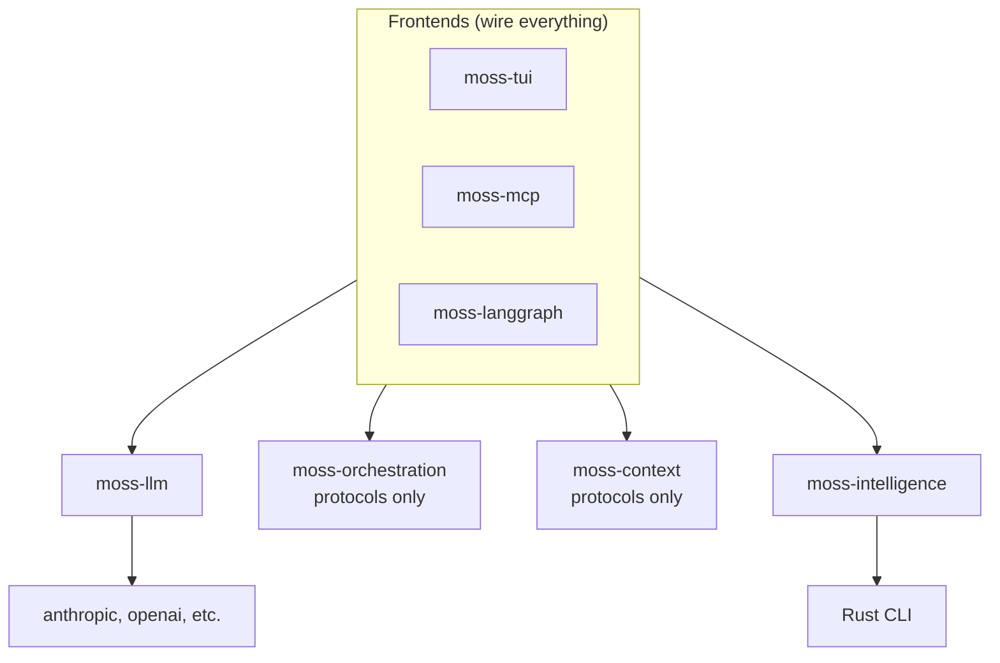
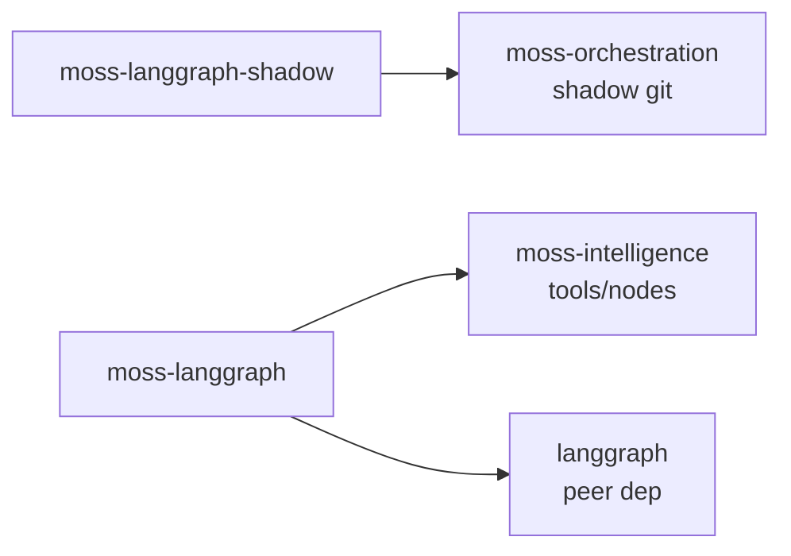

# API Boundaries

Defines the public API surface for each package.

## Design Principles

1. **Stateless where possible** - Pure functions, no hidden state
2. **Tool-shaped** - Easy to expose via MCP, LangGraph, etc.
3. **Composable** - Packages work together but don't require each other
4. **Protocol-based** - Use protocols/interfaces, not concrete classes

---

## moss-intelligence

Code understanding. Stateless, pure.

### Core API

```python
from moss_intelligence import Intelligence

intel = Intelligence(root="/path/to/project")

# Views
intel.view(locator: str) -> ViewResult
intel.skeleton(path: str) -> list[Symbol]
intel.tree(path: str, depth: int = 2) -> TreeNode

# Analysis
intel.analyze(target: str) -> AnalysisResult
intel.complexity(path: str) -> ComplexityReport
intel.security(path: str) -> SecurityReport
intel.dependencies(path: str) -> DependencyGraph
intel.call_graph(path: str) -> CallGraph

# Search
intel.search(query: str) -> list[SearchResult]
intel.symbols(pattern: str) -> list[Symbol]
intel.references(symbol: str) -> list[Reference]
```

### Characteristics
- **Stateless**: Same input → same output
- **Pure**: No side effects (except reading files)
- **Cacheable**: Results can be memoized
- **Parallelizable**: No shared state

### What it does NOT do
- Manage working memory
- Run agent loops
- Persist state
- Make LLM calls

---

## moss-context

Working memory for agents. Domain-agnostic.

### Core API

```python
from moss_context import WorkingMemory, Item

# Create working memory with token budget
memory = WorkingMemory(budget=8000)

# Add items (any content, not code-specific)
memory.add(Item(
    id="file:src/main.py",
    content="...",
    relevance=0.9,
    tokens=150
))

# Query and manage
memory.get(id: str) -> Item | None
memory.remove(id: str) -> bool
memory.update(id: str, **changes) -> Item

# Budgeting
memory.fits(content: str) -> bool
memory.compact() -> int  # Returns tokens freed
memory.summarize(items: list[str]) -> str  # Compress multiple items

# Render for LLM
memory.render() -> str  # Current working memory as prompt
memory.render_diff(previous: str) -> str  # What changed
```

### Strategies (pluggable)

```python
from moss_context.strategies import (
    FIFOEviction,      # Evict oldest first
    LRUEviction,       # Evict least recently used
    RelevanceEviction, # Evict lowest relevance
    SummaryCompaction, # Summarize instead of evict
)

memory = WorkingMemory(
    budget=8000,
    eviction=RelevanceEviction(),
    compaction=SummaryCompaction(llm=...)
)
```

### Characteristics
- **Domain-agnostic**: Works for code, docs, anything
- **Budgeted**: Always respects token limits
- **Observable**: Can inspect current state
- **Pluggable**: Strategies for eviction, compaction

### What it does NOT do
- Understand code structure (that's intelligence)
- Run agent loops (that's orchestration)
- Make LLM calls directly (strategies can, but core doesn't)

---

## moss-orchestration

Agent loops, sessions, drivers.

### Core API

```python
from moss_orchestration import Agent, Session, Driver

# Create agent with intelligence + context
agent = Agent(
    intelligence=intel,
    memory=memory,
    driver=LLMDriver(model="claude-3-opus")
)

# Run task
result = await agent.run("Fix the bug in auth.py")

# Session management
session = Session.create(task="...", driver="llm")
session.checkpoint("after_analysis")
session.resume(from_checkpoint="after_analysis")

# Low-level driver protocol
class Driver(Protocol):
    async def decide(self, context: Context) -> Action
    async def on_result(self, action: Action, result: Result) -> None
```

### Shadow Git Integration

```python
from moss_orchestration.shadow import ShadowGit

shadow = ShadowGit(repo="/path/to/project")

# Isolated branches for tasks
branch = await shadow.create_branch("task-123")
await shadow.commit(branch, "WIP: fixing auth")
await shadow.rollback(branch, steps=1)
await shadow.merge(branch, squash=True)
```

### Characteristics
- **Stateful**: Sessions persist across runs
- **Safe**: Shadow git isolation
- **Resumable**: Checkpoints and time-travel
- **Pluggable**: Drivers are swappable

### What it does NOT do
- Understand code (uses intelligence)
- Manage token budgets (uses context)
- Provide tool implementations (uses intelligence)

---

## LangGraph Integration Packages

### moss-langgraph (Frontend)

Exposes moss-intelligence as LangGraph tools/nodes.

```python
from moss_langgraph import moss_tools, moss_nodes

# As LangChain tools (for use in any LangGraph)
tools = moss_tools(root="/path/to/project")
# Returns: [view_tool, analyze_tool, edit_tool, ...]

# As LangGraph nodes (pre-built graph components)
from moss_langgraph.nodes import ViewNode, AnalyzeNode, EditNode

graph = StateGraph(CodeState)
graph.add_node("view", ViewNode(intel))
graph.add_node("analyze", AnalyzeNode(intel))
```

### moss-langgraph-shadow (Shadow Git as Service)

LangGraph checkpointer backed by shadow git.

```python
from moss_langgraph_shadow import ShadowCheckpointer

# Use shadow git for LangGraph persistence
checkpointer = ShadowCheckpointer(repo="/path/to/project")

graph = StateGraph(CodeState)
app = graph.compile(checkpointer=checkpointer)

# Now LangGraph checkpoints = git commits
# Time travel = git history
# Rollback = git reset
```

This gives LangGraph:
- **Durable execution** via git commits
- **Time travel** via git history
- **Code-aware checkpoints** (not just state, but actual code changes)

---

## Package Dependencies



**Core packages define protocols. moss-llm provides implementations. Frontends wire together.**

LangGraph-specific:



## Frontend Packages

Each frontend is a thin wrapper:

```python
# moss-mcp
from moss_mcp import create_server
server = create_server(intel)  # Just wraps intelligence

# moss-tui
from moss_tui import TUI
app = TUI(intel, orchestration=orch)  # Optional orchestration

# moss-lsp
from moss_lsp import LanguageServer
server = LanguageServer(intel)
```

---

## Resolved Questions

### Edit: Both packages, different meanings

**moss-intelligence**: Structural edit (AST-aware, deterministic)
```python
intel.edit(path, changes)  # Structural, no LLM
```

**moss-orchestration**: Edit as agent action (with LLM, validation loop)
```python
await agent.edit(path, task)  # LLM-driven, with validation
```

Different tools, can share name or not. Structural edit stays "edit", not "patch".

### Sync vs Async

- **Intelligence**: Sync (pure, fast, no I/O beyond file reads)
- **Context**: Sync (in-memory operations)
- **Orchestration**: Async (LLM calls, I/O, long-running)
- **Frontends**: Depends on protocol

### LLM as Plugin (Everywhere)

LLM is outside all core packages. Each defines protocols, `moss-llm` provides implementations.

```python
# moss-context: defines protocol
class Summarizer(Protocol):
    def summarize(self, items: list[str]) -> str: ...

# moss-orchestration: defines protocol
class DecisionMaker(Protocol):
    async def decide(self, context: Context) -> Action: ...
```

**moss-llm** - Utility package providing LLM-backed implementations via litellm:

```python
# moss-llm: implements protocols using litellm (provider-agnostic)
from moss_llm import LLMSummarizer, LLMDecider
import litellm

class LLMSummarizer:
    """Implements Summarizer protocol using litellm."""
    def __init__(self, model: str = "claude-3-haiku-20240307"):
        self.model = model

    def summarize(self, items: list[str]) -> str:
        prompt = f"Summarize concisely:\n{chr(10).join(items)}"
        response = litellm.completion(
            model=self.model,
            messages=[{"role": "user", "content": prompt}]
        )
        return response.choices[0].message.content

class LLMDecider:
    """Implements DecisionMaker protocol using litellm."""
    def __init__(self, model: str = "claude-sonnet-4-20250514"):
        self.model = model

    async def decide(self, context: Context) -> Action:
        response = await litellm.acompletion(
            model=self.model,
            messages=[...]
        )
        # ... parse response into Action
```

**Frontend wires everything together:**

```python
# moss-tui (or any frontend)
from moss_intelligence import Intelligence
from moss_context import WorkingMemory
from moss_orchestration import Agent
from moss_llm import LLMSummarizer, LLMDecider

# Just set env vars for provider auth
# ANTHROPIC_API_KEY, OPENAI_API_KEY, etc.

memory = WorkingMemory(
    summarizer=LLMSummarizer(model="claude-3-haiku-20240307")
)

agent = Agent(
    intelligence=Intelligence(root),
    memory=memory,
    decision_maker=LLMDecider(model="claude-sonnet-4-20250514")
)
```

**Result**:
- Core packages (intelligence, context, orchestration) have no LLM dependency
- moss-llm uses litellm for provider abstraction
- Switch providers by changing model string, not code
- Frontends can use moss-llm or provide custom protocol implementations

## Open Questions

1. **Error handling strategy?**
   - Custom exceptions per package?
   - Result types?
   - Both?
