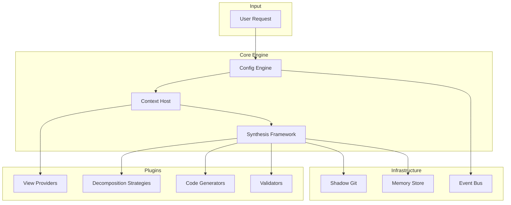

# Architecture Overview

Moss follows a layered architecture with clear separation of concerns.

## Core Components



## Component Descriptions

### Config Engine

Loads and validates configuration from `moss.toml`, environment variables, and CLI flags. Enforces safety policies.

### Context Host

Manages **View Providers** that extract structural information from code:

- **Skeleton View** - Function/class signatures without bodies
- **CFG View** - Control flow graphs
- **Dependency View** - Import relationships

### Synthesis Framework

Orchestrates code synthesis through:

1. **Decomposition** - Break complex problems into subproblems
2. **Generation** - Produce code for atomic problems
3. **Composition** - Combine solutions
4. **Validation** - Verify correctness

### Shadow Git

Provides atomic commits per tool call:

- Automatic checkpoint before changes
- Rollback on validation failure
- Clean history for review

### Event Bus

Async pub/sub communication between components:

```python
# Event types
UserMessage      # User input
PlanGenerated    # Planning complete
ToolCall         # Tool invocation
ValidationFailed # Validation error
ShadowCommit     # Git checkpoint
```

### Memory Store

Episodic memory for learning:

- Strategy success rates
- Abstraction library
- User preferences

## Data Flow

```
User Request
    │
    ▼
Config Engine ──► Policy check (velocity, quarantine)
    │
    ▼
Context Host ──► View Providers extract structure
    │
    ▼
Synthesis Framework
    │
    ├──► Router selects strategy
    ├──► Strategy decomposes problem
    ├──► Generator produces code
    └──► Validator checks correctness
           │
           ▼ (retry loop if error)
    │
    ▼
Shadow Git ──► Atomic commit
    │
    ▼
Output
```

## Plugin System

Moss uses entry points for plugin discovery:

```toml
# pyproject.toml
[project.entry-points."moss.plugins"]
python-skeleton = "moss.skeleton:PythonSkeletonPlugin"

[project.entry-points."moss.synthesis.generators"]
template = "moss.synthesis.plugins.generators:TemplateGenerator"
```

See [Plugin System](plugins.md) for details on creating plugins.

## Multi-Agent Model

Moss uses **ticket-based** isolation rather than shared context:

- Agents are isolated microservices
- Communication via Handles, not chat history
- Each agent has its own Shadow Git branch

This enables parallel execution without context conflicts.
