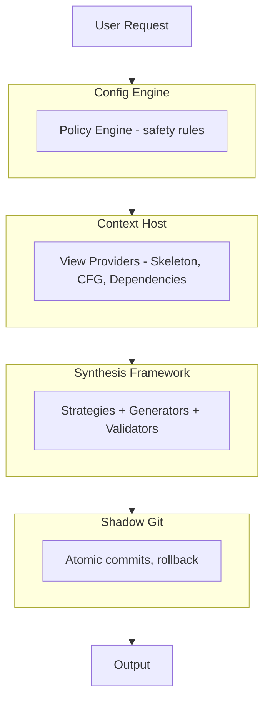

# Moss

**Tooling orchestration with structural awareness.**

Moss implements a "Compiled Context" approach that prioritizes architectural awareness (AST-based understanding) over raw text processing, with verification loops ensuring correctness before output.

## Key Features

- **Structural Editing** - AST-based code modifications with fuzzy anchor matching
- **Shadow Git** - Atomic commits per tool call, automatic rollback on failure
- **Verification Loops** - Domain-specific validation (compiler, linter, tests)
- **Plugin Architecture** - Extensible view providers, synthesis strategies, generators
- **Code Synthesis** - Decompose complex tasks into solvable subproblems

## Quick Example

```bash
# Synthesize code from a specification
moss synthesize "Create a function that validates email addresses" \
    --type "(email: str) -> bool"

# See how a task would be decomposed
moss synthesize "Build a REST API with CRUD for users" --dry-run
```

## Architecture Overview



## Installation

```bash
# Clone the repository
git clone https://github.com/pterror/moss
cd moss

# Using nix (recommended)
nix develop

# Or using pip
pip install -e ".[dev]"
```

## Next Steps

- [Installation Guide](getting-started/installation.md) - Detailed setup instructions
- [Quickstart](getting-started/quickstart.md) - Your first synthesis
- [Architecture Overview](architecture/overview.md) - How Moss works
- [Synthesis Guide](synthesis/overview.md) - Understanding code synthesis
