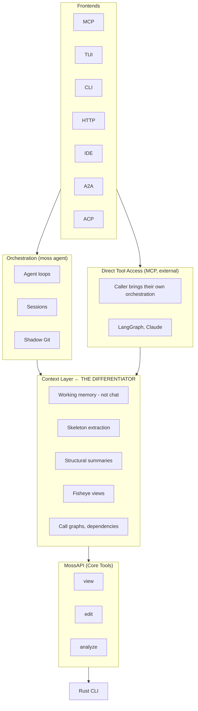

# LangGraph Evaluation

Evaluating moss's relationship to LangGraph and the broader agent ecosystem.

## TL;DR

Moss is a **code intelligence tool**, not an agent framework. LangGraph handles orchestration well; we handle context well. These are complementary, not competing.

**Our differentiator**: Working memory, not chat history. Current agents (LangGraph, Claude, Cursor) think in conversation - messages accumulate until truncated. But thinking isn't conversation. Agents need structured working memory they can manage. That's the gap.

## Layered Architecture



## What LangGraph Does Well

1. **Orchestration primitives** - Graphs, nodes, edges, conditional routing
2. **Persistence** - Multiple backends (memory, sqlite, postgres)
3. **Time travel** - Fork from any checkpoint, debug decisions
4. **Streaming** - Token-by-token, node updates, custom events
5. **Human-in-the-loop** - `interrupt()` + `Command` primitive
6. **Durable execution** - `task` decorator caches side effects
7. **Ecosystem** - LangSmith Studio, LangGraph Platform

## What LangGraph Doesn't Do

1. **Working memory management** - Agents think in chat history, but thinking ≠ conversation
   - Chat history is the wrong abstraction for agent cognition
   - Agents need working memory, not conversation logs
   - Current model: accumulate messages until truncation
   - Better model: structured working memory the agent can manage
2. **Code-aware context** - "What's the minimal context for this function?"
3. **Structural representations** - Skeletons, AST-level views
4. **Token efficiency** - "Summarize this codebase in 2k tokens"
5. **Safe code modification** - Shadow git, atomic rollbacks
6. **Multi-language understanding** - Call graphs across Python/Rust/etc.

**The fundamental gap**: Chat history is not working memory. Agents need to manage working memory, not accumulate conversation.

## Layer Responsibilities

| Layer | Ships with moss? | Could use external? |
|-------|------------------|---------------------|
| Frontends | TUI, CLI, MCP | IDE plugins, web, A2A |
| Orchestration | Yes (low friction OOTB) | LangGraph, Claude, etc. |
| **Context** | **Yes (core value)** | **No - this is us** |
| Tools | Yes | - |
| Engine | Rust CLI | - |

## Practical Implications

### MossAPI should be tool-shaped
Pure, stateless tools that any orchestrator can call:
- `view(locator)` → structured code view
- `edit(path, task)` → safe modification
- `analyze(target)` → health/complexity/security

### Orchestration is optional, separate
- Ship `moss agent` for low-friction OOTB experience
- But don't bake it into MossAPI
- External callers (LangGraph, Claude) bring their own

### Context Layer is the product
What makes moss valuable:
- **Working memory primitives** - Structure over chat history
- Skeleton extraction (structure without implementation)
- Fisheye views (focused context with surrounding awareness)
- Call graphs (understand flow without reading everything)
- Token-efficient summaries (right context, right size)

The key insight: thinking ≠ conversation. Agents need working memory, not message logs.

## LangGraph Integration (If Wanted)

Moss as tool provider, LangGraph as orchestrator:

```python
from langgraph.graph import StateGraph
from langchain_core.tools import tool
from moss import MossAPI

api = MossAPI.for_project(".")

@tool
def view_code(locator: str) -> str:
    """View code structure efficiently."""
    return api.view.view(locator)

@tool
def edit_code(path: str, task: str) -> str:
    """Edit code with structural awareness."""
    return api.edit.edit(path, task)

@tool
def analyze_code(target: str) -> str:
    """Analyze code health, complexity, security."""
    return api.analyze.analyze(target)

# LangGraph handles orchestration
# Moss handles code intelligence
```

## LangSmith Studio

Nice for debugging agent decisions, but:
- Paid service dependency
- Reflects LangGraph's model, not ours
- Our TUI may better reflect moss's context-centric model

Not a reason to adopt or reject LangGraph.

## Recommendations

1. **Don't replace our orchestration with LangGraph** - Different problem
2. **Do keep MossAPI tool-shaped** - Usable by any orchestrator
3. **Do ship orchestration separately** - `moss agent` for OOTB experience
4. **Do make Context Layer explicit** - Reusable by external callers
5. **Consider LangGraph integration** - As one frontend, not foundation

## Summary

| Concern | LangGraph | Moss |
|---------|-----------|------|
| Orchestration | ✓ Their strength | Optional, ships separately |
| Working memory | ✗ Chat history | ✓ Structured, manageable |
| Persistence | ✓ Mature | Shadow Git (code-specific) |
| Multi-frontend | ✗ Python graphs | ✓ MCP, TUI, CLI, HTTP, A2A |

**Moss provides working memory primitives.**
**LangGraph provides orchestration.**

The fundamental problem: current agents think in chat history, but thinking isn't conversation. Agents need structured working memory. Moss provides the primitives for that.
