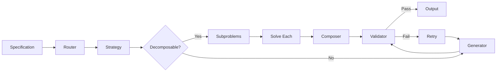

# Synthesis Overview

Code synthesis in Moss follows a **decompose-solve-compose** pattern inspired by program synthesis research.

## How It Works



## Core Concepts

### Specification

A description of what to synthesize:

```python
from moss.synthesis import Specification

spec = Specification(
    description="Sort a list of numbers",
    type_signature="List[int] -> List[int]",
    examples=(([3, 1, 2], [1, 2, 3]),),
    constraints=("must be stable", "O(n log n)"),
)
```

### Context

Available resources and solved subproblems:

```python
from moss.synthesis import Context

context = Context(
    primitives=("sort", "filter", "map"),
    solved={"validate_input": "def validate(x): ..."},
)
```

### Subproblem

A decomposed piece of the original problem:

```python
from moss.synthesis import Subproblem

subproblem = Subproblem(
    specification=Specification(description="Compare two elements"),
    dependencies=(0,),  # Depends on subproblem 0
    priority=1,
)
```

## The Synthesis Loop

1. **Route** - Select best decomposition strategy
2. **Decompose** - Break into subproblems (or solve atomically)
3. **Solve** - Recursively synthesize each subproblem
4. **Compose** - Combine solutions
5. **Validate** - Check correctness
6. **Retry** - If validation fails, regenerate

```python
from moss.synthesis import SynthesisFramework

framework = SynthesisFramework()
result = await framework.synthesize(spec)

if result.success:
    print(result.solution)
else:
    print(f"Failed: {result.error}")
```

## Strategy Selection

The router scores each strategy and selects the best:

```python
# Strategies are scored based on:
# 1. can_handle() - Does the strategy apply?
# 2. estimate_success() - How confident is it?
# 3. Historical success rate (learned over time)

strategy = await router.select_strategy(spec, context)
```

## Atomic vs Decomposed

Problems are solved atomically when:

- No strategy can decompose further
- Strategy returns empty subproblem list
- Max depth is reached

```python
# Atomic solving uses generators
result = await generator.generate(spec, context, hints)
```

## Validation Retry Loop

When validation fails, Moss retries:

```python
# Retry loop pseudocode
for retry in range(max_retries):
    code = await generator.generate(spec, context, hints)
    result = await validator.validate(spec, code)

    if result.success:
        return code

    # Add validation errors as hints for next attempt
    hints.constraints.extend(result.issues)
```

## Configuration

```toml
# moss.toml
[synthesis]
max_depth = 5
max_iterations = 50
parallel_subproblems = true
max_validation_retries = 2

[synthesis.generators]
enabled = ["template", "llm"]
```

## Next Steps

- [Strategies](strategies.md) - Available decomposition strategies
- [Generators](generators.md) - Code generation approaches
- [Roadmap](roadmap.md) - Future generator implementations
